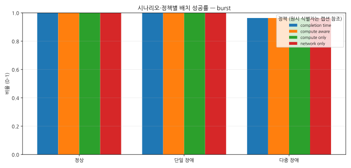
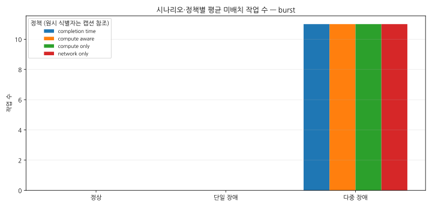
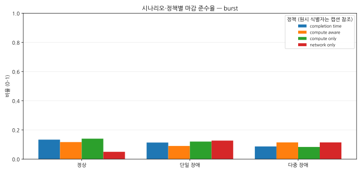
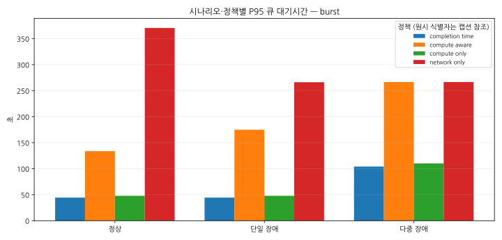
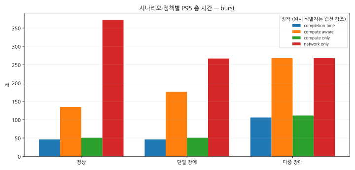
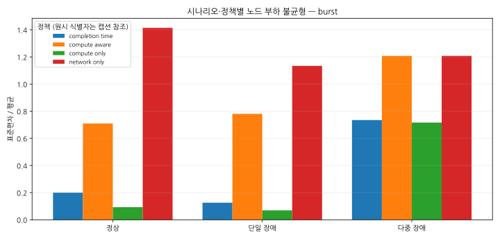
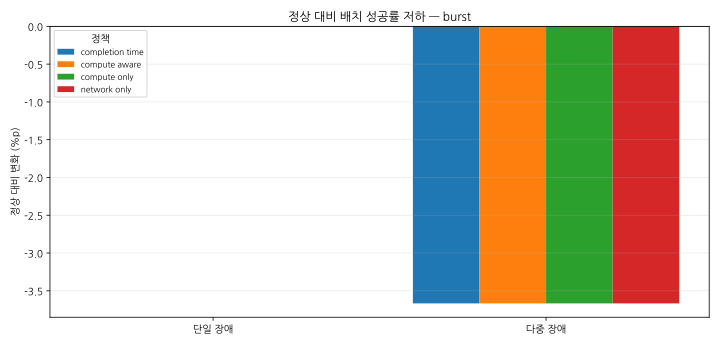

# 우주 AI 데이터센터 결정적 배치 실험 보고서

생성 시각(UTC): 2026-07-28T07:18:41.682706+00:00

- 저장소 리비전: 8862c72f77c22fabe3e84e821651e5a4cd46239e
- Python: 3.14.4
- 요청 행렬: scenarios=normal,single,multi; policies=compute_only,network_only,compute_aware,completion_time; workloads=burst; seeds=0,1,2,3,4,5,6,7,8,9,10,11,12,13,14,15,16,17,18,19
- 성공 실행: 240, 실패 실행: 0

## 발표용 핵심 결과

- 단일 장애 조건에서 completion_time 정책의 배치 성공률은(는) 정상 대비 +0.00%p 변화했습니다.
- 단일 장애 조건에서 completion_time 정책의 평균 미배치 작업 수은(는) 정상 대비 절대 변화 +0, 상대 변화 계산 불가(정상 기준 0) 변화했습니다.
- 단일 장애 조건에서 completion_time 정책의 마감 준수율은(는) 정상 대비 -2.00%p 변화했습니다.
- 단일 장애 조건에서 completion_time 정책의 평균 큐 대기시간은(는) 정상 대비 +0.32% 변화했습니다.
- 단일 장애 조건에서 completion_time 정책의 P95 큐 대기시간은(는) 정상 대비 +0.00% 변화했습니다.

## 방법론

결과는 명시적 시드를 사용한 반복 결정적 시뮬레이션에서 생성되었습니다. 집계 비교는 `summary.csv`, 실행 분포와 검증은 `runs.csv`, 정책 순위는 기존 평가 규칙이 기록된 `policy_ranking.csv`를 사용했습니다.

- 백분위수: nearest-rank (ceil(p*n), minimum rank 1)
- 표준편차: sample standard deviation (n-1); null for fewer than 2 values
- 순위 규칙: 배치 성공률 내림차순, 마감 준수율 내림차순, 미배치 수 오름차순, P95 총 시간 오름차순, 노드 부하 불균형 오름차순의 기존 사전식 평가 규칙입니다. 이는 AI 의사결정 규칙이 아닙니다.

## 전체 비교

| 시나리오 | 워크로드 | 정책 | 배치 성공률 | 평균 미배치 작업 수 | 마감 준수율 | 평균 큐 대기시간 | P95 큐 대기시간 | 평균 총 시간 | P95 총 시간 | 노드 부하 불균형 |
| --- | --- | --- | --- | --- | --- | --- | --- | --- | --- | --- |
| 정상 | burst | completion_time | 1.0000 | 0 | 0.1333 | 22.42 | 44.39 | 24.28 | 46.13 | 0.2002 |
| 정상 | burst | compute_aware | 1.0000 | 0 | 0.1167 | 54.65 | 133.7 | 56.43 | 134.7 | 0.7094 |
| 정상 | burst | compute_only | 1.0000 | 0 | 0.1400 | 22.47 | 47.85 | 24.37 | 50.67 | 0.09274 |
| 정상 | burst | network_only | 1.0000 | 0 | 0.0500 | 186.8 | 370.4 | 188.8 | 372.4 | 1.414 |
| 단일 장애 | burst | completion_time | 1.0000 | 0 | 0.1133 | 22.49 | 44.39 | 24.37 | 46.13 | 0.1257 |
| 단일 장애 | burst | compute_aware | 1.0000 | 0 | 0.0900 | 67.89 | 174.9 | 69.61 | 175.8 | 0.7803 |
| 단일 장애 | burst | compute_only | 1.0000 | 0 | 0.1200 | 22.54 | 47.85 | 24.44 | 50.68 | 0.06976 |
| 단일 장애 | burst | network_only | 1.0000 | 0 | 0.1267 | 115.7 | 266.1 | 117.3 | 266.8 | 1.134 |
| 다중 장애 | burst | completion_time | 0.9633 | 11 | 0.0865 | 55.29 | 104.1 | 57.05 | 105.9 | 0.7346 |
| 다중 장애 | burst | compute_aware | 0.9633 | 11 | 0.1142 | 120 | 266.5 | 121.7 | 267.8 | 1.208 |
| 다중 장애 | burst | compute_only | 0.9633 | 11 | 0.0830 | 55.34 | 110.2 | 57.12 | 111.3 | 0.7163 |
| 다중 장애 | burst | network_only | 0.9633 | 11 | 0.1142 | 120 | 266.5 | 121.7 | 267.8 | 1.208 |

## 시나리오별 정책 순위

| 시나리오 | 워크로드 | 순위 | 정책 |
| --- | --- | --- | --- |
| 다중 장애 | burst | 1 | compute_aware |
| 다중 장애 | burst | 2 | network_only |
| 다중 장애 | burst | 3 | completion_time |
| 다중 장애 | burst | 4 | compute_only |
| 정상 | burst | 1 | compute_only |
| 정상 | burst | 2 | completion_time |
| 정상 | burst | 3 | compute_aware |
| 정상 | burst | 4 | network_only |
| 단일 장애 | burst | 1 | network_only |
| 단일 장애 | burst | 2 | compute_only |
| 단일 장애 | burst | 3 | completion_time |
| 단일 장애 | burst | 4 | compute_aware |

## 정상 대비 저하

비율 지표는 퍼센트포인트(%p), 시간·개수·불균형은 정상값이 0이 아닐 때 백분율 변화로 표시합니다. 정상값이 0이면 절대 차이는 보존하고 상대 변화는 계산 불가로 표시합니다.

| 시나리오 | 워크로드 | 정책 | 지표 | 정상 | 비교 | 절대/%p 변화 | 상대 변화 |
| --- | --- | --- | --- | --- | --- | --- | --- |
| 단일 장애 | burst | completion_time | 배치 성공률 | 1.0000 | 1.0000 | +0.00%p | 계산 불가 |
| 단일 장애 | burst | completion_time | 평균 미배치 작업 수 | 0 | 0 | 0 | 계산 불가 |
| 단일 장애 | burst | completion_time | 마감 준수율 | 0.1333 | 0.1133 | -2.00%p | 계산 불가 |
| 단일 장애 | burst | completion_time | 평균 큐 대기시간 | 22.42 | 22.49 | 0.07073 | +0.32% |
| 단일 장애 | burst | completion_time | P95 큐 대기시간 | 44.39 | 44.39 | 0 | +0.00% |
| 단일 장애 | burst | completion_time | 평균 총 시간 | 24.28 | 24.37 | 0.09028 | +0.37% |
| 단일 장애 | burst | completion_time | P95 총 시간 | 46.13 | 46.13 | 0 | +0.00% |
| 단일 장애 | burst | completion_time | 노드 부하 불균형 | 0.2002 | 0.1257 | -0.07447 | -37.20% |
| 단일 장애 | burst | compute_aware | 배치 성공률 | 1.0000 | 1.0000 | +0.00%p | 계산 불가 |
| 단일 장애 | burst | compute_aware | 평균 미배치 작업 수 | 0 | 0 | 0 | 계산 불가 |
| 단일 장애 | burst | compute_aware | 마감 준수율 | 0.1167 | 0.0900 | -2.67%p | 계산 불가 |
| 단일 장애 | burst | compute_aware | 평균 큐 대기시간 | 54.65 | 67.89 | 13.24 | +24.23% |
| 단일 장애 | burst | compute_aware | P95 큐 대기시간 | 133.7 | 174.9 | 41.17 | +30.79% |
| 단일 장애 | burst | compute_aware | 평균 총 시간 | 56.43 | 69.61 | 13.18 | +23.36% |
| 단일 장애 | burst | compute_aware | P95 총 시간 | 134.7 | 175.8 | 41.1 | +30.52% |
| 단일 장애 | burst | compute_aware | 노드 부하 불균형 | 0.7094 | 0.7803 | 0.07089 | +9.99% |
| 단일 장애 | burst | compute_only | 배치 성공률 | 1.0000 | 1.0000 | +0.00%p | 계산 불가 |
| 단일 장애 | burst | compute_only | 평균 미배치 작업 수 | 0 | 0 | 0 | 계산 불가 |
| 단일 장애 | burst | compute_only | 마감 준수율 | 0.1400 | 0.1200 | -2.00%p | 계산 불가 |
| 단일 장애 | burst | compute_only | 평균 큐 대기시간 | 22.47 | 22.54 | 0.0707 | +0.31% |
| 단일 장애 | burst | compute_only | P95 큐 대기시간 | 47.85 | 47.85 | 0 | +0.00% |
| 단일 장애 | burst | compute_only | 평균 총 시간 | 24.37 | 24.44 | 0.07464 | +0.31% |
| 단일 장애 | burst | compute_only | P95 총 시간 | 50.67 | 50.68 | 0.00775 | +0.02% |
| 단일 장애 | burst | compute_only | 노드 부하 불균형 | 0.09274 | 0.06976 | -0.02297 | -24.77% |
| 단일 장애 | burst | network_only | 배치 성공률 | 1.0000 | 1.0000 | +0.00%p | 계산 불가 |
| 단일 장애 | burst | network_only | 평균 미배치 작업 수 | 0 | 0 | 0 | 계산 불가 |
| 단일 장애 | burst | network_only | 마감 준수율 | 0.0500 | 0.1267 | +7.67%p | 계산 불가 |
| 단일 장애 | burst | network_only | 평균 큐 대기시간 | 186.8 | 115.7 | -71.16 | -38.09% |
| 단일 장애 | burst | network_only | P95 큐 대기시간 | 370.4 | 266.1 | -104.3 | -28.16% |
| 단일 장애 | burst | network_only | 평균 총 시간 | 188.8 | 117.3 | -71.43 | -37.84% |
| 단일 장애 | burst | network_only | P95 총 시간 | 372.4 | 266.8 | -105.6 | -28.35% |
| 단일 장애 | burst | network_only | 노드 부하 불균형 | 1.414 | 1.134 | -0.2805 | -19.83% |
| 다중 장애 | burst | completion_time | 배치 성공률 | 1.0000 | 0.9633 | -3.67%p | 계산 불가 |
| 다중 장애 | burst | completion_time | 평균 미배치 작업 수 | 0 | 11 | 11 | 계산 불가 |
| 다중 장애 | burst | completion_time | 마감 준수율 | 0.1333 | 0.0865 | -4.68%p | 계산 불가 |
| 다중 장애 | burst | completion_time | 평균 큐 대기시간 | 22.42 | 55.29 | 32.87 | +146.58% |
| 다중 장애 | burst | completion_time | P95 큐 대기시간 | 44.39 | 104.1 | 59.7 | +134.47% |
| 다중 장애 | burst | completion_time | 평균 총 시간 | 24.28 | 57.05 | 32.77 | +134.96% |
| 다중 장애 | burst | completion_time | P95 총 시간 | 46.13 | 105.9 | 59.81 | +129.66% |
| 다중 장애 | burst | completion_time | 노드 부하 불균형 | 0.2002 | 0.7346 | 0.5345 | +267.01% |
| 다중 장애 | burst | compute_aware | 배치 성공률 | 1.0000 | 0.9633 | -3.67%p | 계산 불가 |
| 다중 장애 | burst | compute_aware | 평균 미배치 작업 수 | 0 | 11 | 11 | 계산 불가 |
| 다중 장애 | burst | compute_aware | 마감 준수율 | 0.1167 | 0.1142 | -0.25%p | 계산 불가 |
| 다중 장애 | burst | compute_aware | 평균 큐 대기시간 | 54.65 | 120 | 65.37 | +119.62% |
| 다중 장애 | burst | compute_aware | P95 큐 대기시간 | 133.7 | 266.5 | 132.8 | +99.35% |
| 다중 장애 | burst | compute_aware | 평균 총 시간 | 56.43 | 121.7 | 65.23 | +115.60% |
| 다중 장애 | burst | compute_aware | P95 총 시간 | 134.7 | 267.8 | 133.1 | +98.83% |
| 다중 장애 | burst | compute_aware | 노드 부하 불균형 | 0.7094 | 1.208 | 0.4982 | +70.23% |
| 다중 장애 | burst | compute_only | 배치 성공률 | 1.0000 | 0.9633 | -3.67%p | 계산 불가 |
| 다중 장애 | burst | compute_only | 평균 미배치 작업 수 | 0 | 11 | 11 | 계산 불가 |
| 다중 장애 | burst | compute_only | 마감 준수율 | 0.1400 | 0.0830 | -5.70%p | 계산 불가 |
| 다중 장애 | burst | compute_only | 평균 큐 대기시간 | 22.47 | 55.34 | 32.87 | +146.29% |
| 다중 장애 | burst | compute_only | P95 큐 대기시간 | 47.85 | 110.2 | 62.34 | +130.28% |
| 다중 장애 | burst | compute_only | 평균 총 시간 | 24.37 | 57.12 | 32.75 | +134.42% |
| 다중 장애 | burst | compute_only | P95 총 시간 | 50.67 | 111.3 | 60.59 | +119.56% |
| 다중 장애 | burst | compute_only | 노드 부하 불균형 | 0.09274 | 0.7163 | 0.6236 | +672.41% |
| 다중 장애 | burst | network_only | 배치 성공률 | 1.0000 | 0.9633 | -3.67%p | 계산 불가 |
| 다중 장애 | burst | network_only | 평균 미배치 작업 수 | 0 | 11 | 11 | 계산 불가 |
| 다중 장애 | burst | network_only | 마감 준수율 | 0.0500 | 0.1142 | +6.42%p | 계산 불가 |
| 다중 장애 | burst | network_only | 평균 큐 대기시간 | 186.8 | 120 | -66.83 | -35.77% |
| 다중 장애 | burst | network_only | P95 큐 대기시간 | 370.4 | 266.5 | -103.9 | -28.05% |
| 다중 장애 | burst | network_only | 평균 총 시간 | 188.8 | 121.7 | -67.11 | -35.55% |
| 다중 장애 | burst | network_only | P95 총 시간 | 372.4 | 267.8 | -104.7 | -28.10% |
| 다중 장애 | burst | network_only | 노드 부하 불균형 | 1.414 | 1.208 | -0.2066 | -14.61% |

## 핵심 발견

- [F0001] 단일 장애 조건에서 completion_time 정책의 배치 성공률은(는) 정상 대비 +0.00%p 변화했습니다. (관측 결과)
- [F0002] 단일 장애 조건에서 completion_time 정책의 평균 미배치 작업 수은(는) 정상 대비 절대 변화 +0, 상대 변화 계산 불가(정상 기준 0) 변화했습니다. (관측 결과)
- [F0003] 단일 장애 조건에서 completion_time 정책의 마감 준수율은(는) 정상 대비 -2.00%p 변화했습니다. (관측 결과)
- [F0004] 단일 장애 조건에서 completion_time 정책의 평균 큐 대기시간은(는) 정상 대비 +0.32% 변화했습니다. (관측 결과)
- [F0005] 단일 장애 조건에서 completion_time 정책의 P95 큐 대기시간은(는) 정상 대비 +0.00% 변화했습니다. (관측 결과)
- [F0006] 단일 장애 조건에서 completion_time 정책의 평균 총 시간은(는) 정상 대비 +0.37% 변화했습니다. (관측 결과)
- [F0007] 단일 장애 조건에서 completion_time 정책의 P95 총 시간은(는) 정상 대비 +0.00% 변화했습니다. (관측 결과)
- [F0008] 단일 장애 조건에서 completion_time 정책의 노드 부하 불균형은(는) 정상 대비 -37.20% 변화했습니다. (관측 결과)
- [F0009] 단일 장애 조건에서 compute_aware 정책의 배치 성공률은(는) 정상 대비 +0.00%p 변화했습니다. (관측 결과)
- [F0010] 단일 장애 조건에서 compute_aware 정책의 평균 미배치 작업 수은(는) 정상 대비 절대 변화 +0, 상대 변화 계산 불가(정상 기준 0) 변화했습니다. (관측 결과)
- [F0011] 단일 장애 조건에서 compute_aware 정책의 마감 준수율은(는) 정상 대비 -2.67%p 변화했습니다. (관측 결과)
- [F0012] 단일 장애 조건에서 compute_aware 정책의 평균 큐 대기시간은(는) 정상 대비 +24.23% 변화했습니다. (관측 결과)
- [F0013] 단일 장애 조건에서 compute_aware 정책의 P95 큐 대기시간은(는) 정상 대비 +30.79% 변화했습니다. (관측 결과)
- [F0014] 단일 장애 조건에서 compute_aware 정책의 평균 총 시간은(는) 정상 대비 +23.36% 변화했습니다. (관측 결과)
- [F0015] 단일 장애 조건에서 compute_aware 정책의 P95 총 시간은(는) 정상 대비 +30.52% 변화했습니다. (관측 결과)
- [F0016] 단일 장애 조건에서 compute_aware 정책의 노드 부하 불균형은(는) 정상 대비 +9.99% 변화했습니다. (관측 결과)
- [F0017] 단일 장애 조건에서 compute_only 정책의 배치 성공률은(는) 정상 대비 +0.00%p 변화했습니다. (관측 결과)
- [F0018] 단일 장애 조건에서 compute_only 정책의 평균 미배치 작업 수은(는) 정상 대비 절대 변화 +0, 상대 변화 계산 불가(정상 기준 0) 변화했습니다. (관측 결과)
- [F0019] 단일 장애 조건에서 compute_only 정책의 마감 준수율은(는) 정상 대비 -2.00%p 변화했습니다. (관측 결과)
- [F0020] 단일 장애 조건에서 compute_only 정책의 평균 큐 대기시간은(는) 정상 대비 +0.31% 변화했습니다. (관측 결과)
- [F0021] 단일 장애 조건에서 compute_only 정책의 P95 큐 대기시간은(는) 정상 대비 +0.00% 변화했습니다. (관측 결과)
- [F0022] 단일 장애 조건에서 compute_only 정책의 평균 총 시간은(는) 정상 대비 +0.31% 변화했습니다. (관측 결과)
- [F0023] 단일 장애 조건에서 compute_only 정책의 P95 총 시간은(는) 정상 대비 +0.02% 변화했습니다. (관측 결과)
- [F0024] 단일 장애 조건에서 compute_only 정책의 노드 부하 불균형은(는) 정상 대비 -24.77% 변화했습니다. (관측 결과)
- [F0025] 단일 장애 조건에서 network_only 정책의 배치 성공률은(는) 정상 대비 +0.00%p 변화했습니다. (관측 결과)
- [F0026] 단일 장애 조건에서 network_only 정책의 평균 미배치 작업 수은(는) 정상 대비 절대 변화 +0, 상대 변화 계산 불가(정상 기준 0) 변화했습니다. (관측 결과)
- [F0027] 단일 장애 조건에서 network_only 정책의 마감 준수율은(는) 정상 대비 +7.67%p 변화했습니다. (관측 결과)
- [F0028] 단일 장애 조건에서 network_only 정책의 평균 큐 대기시간은(는) 정상 대비 -38.09% 변화했습니다. (관측 결과)
- [F0029] 단일 장애 조건에서 network_only 정책의 P95 큐 대기시간은(는) 정상 대비 -28.16% 변화했습니다. (관측 결과)
- [F0030] 단일 장애 조건에서 network_only 정책의 평균 총 시간은(는) 정상 대비 -37.84% 변화했습니다. (관측 결과)
- [F0031] 단일 장애 조건에서 network_only 정책의 P95 총 시간은(는) 정상 대비 -28.35% 변화했습니다. (관측 결과)
- [F0032] 단일 장애 조건에서 network_only 정책의 노드 부하 불균형은(는) 정상 대비 -19.83% 변화했습니다. (관측 결과)
- [F0033] 다중 장애 조건에서 completion_time 정책의 배치 성공률은(는) 정상 대비 -3.67%p 변화했습니다. (관측 결과)
- [F0034] 다중 장애 조건에서 completion_time 정책의 평균 미배치 작업 수은(는) 정상 대비 절대 변화 +11, 상대 변화 계산 불가(정상 기준 0) 변화했습니다. (관측 결과)
- [F0035] 다중 장애 조건에서 completion_time 정책의 마감 준수율은(는) 정상 대비 -4.68%p 변화했습니다. (관측 결과)
- [F0036] 다중 장애 조건에서 completion_time 정책의 평균 큐 대기시간은(는) 정상 대비 +146.58% 변화했습니다. (관측 결과)
- [F0037] 다중 장애 조건에서 completion_time 정책의 P95 큐 대기시간은(는) 정상 대비 +134.47% 변화했습니다. (관측 결과)
- [F0038] 다중 장애 조건에서 completion_time 정책의 평균 총 시간은(는) 정상 대비 +134.96% 변화했습니다. (관측 결과)
- [F0039] 다중 장애 조건에서 completion_time 정책의 P95 총 시간은(는) 정상 대비 +129.66% 변화했습니다. (관측 결과)
- [F0040] 다중 장애 조건에서 completion_time 정책의 노드 부하 불균형은(는) 정상 대비 +267.01% 변화했습니다. (관측 결과)
- [F0041] 다중 장애 조건에서 compute_aware 정책의 배치 성공률은(는) 정상 대비 -3.67%p 변화했습니다. (관측 결과)
- [F0042] 다중 장애 조건에서 compute_aware 정책의 평균 미배치 작업 수은(는) 정상 대비 절대 변화 +11, 상대 변화 계산 불가(정상 기준 0) 변화했습니다. (관측 결과)
- [F0043] 다중 장애 조건에서 compute_aware 정책의 마감 준수율은(는) 정상 대비 -0.25%p 변화했습니다. (관측 결과)
- [F0044] 다중 장애 조건에서 compute_aware 정책의 평균 큐 대기시간은(는) 정상 대비 +119.62% 변화했습니다. (관측 결과)
- [F0045] 다중 장애 조건에서 compute_aware 정책의 P95 큐 대기시간은(는) 정상 대비 +99.35% 변화했습니다. (관측 결과)
- [F0046] 다중 장애 조건에서 compute_aware 정책의 평균 총 시간은(는) 정상 대비 +115.60% 변화했습니다. (관측 결과)
- [F0047] 다중 장애 조건에서 compute_aware 정책의 P95 총 시간은(는) 정상 대비 +98.83% 변화했습니다. (관측 결과)
- [F0048] 다중 장애 조건에서 compute_aware 정책의 노드 부하 불균형은(는) 정상 대비 +70.23% 변화했습니다. (관측 결과)
- [F0049] 다중 장애 조건에서 compute_only 정책의 배치 성공률은(는) 정상 대비 -3.67%p 변화했습니다. (관측 결과)
- [F0050] 다중 장애 조건에서 compute_only 정책의 평균 미배치 작업 수은(는) 정상 대비 절대 변화 +11, 상대 변화 계산 불가(정상 기준 0) 변화했습니다. (관측 결과)
- [F0051] 다중 장애 조건에서 compute_only 정책의 마감 준수율은(는) 정상 대비 -5.70%p 변화했습니다. (관측 결과)
- [F0052] 다중 장애 조건에서 compute_only 정책의 평균 큐 대기시간은(는) 정상 대비 +146.29% 변화했습니다. (관측 결과)
- [F0053] 다중 장애 조건에서 compute_only 정책의 P95 큐 대기시간은(는) 정상 대비 +130.28% 변화했습니다. (관측 결과)
- [F0054] 다중 장애 조건에서 compute_only 정책의 평균 총 시간은(는) 정상 대비 +134.42% 변화했습니다. (관측 결과)
- [F0055] 다중 장애 조건에서 compute_only 정책의 P95 총 시간은(는) 정상 대비 +119.56% 변화했습니다. (관측 결과)
- [F0056] 다중 장애 조건에서 compute_only 정책의 노드 부하 불균형은(는) 정상 대비 +672.41% 변화했습니다. (관측 결과)
- [F0057] 다중 장애 조건에서 network_only 정책의 배치 성공률은(는) 정상 대비 -3.67%p 변화했습니다. (관측 결과)
- [F0058] 다중 장애 조건에서 network_only 정책의 평균 미배치 작업 수은(는) 정상 대비 절대 변화 +11, 상대 변화 계산 불가(정상 기준 0) 변화했습니다. (관측 결과)
- [F0059] 다중 장애 조건에서 network_only 정책의 마감 준수율은(는) 정상 대비 +6.42%p 변화했습니다. (관측 결과)
- [F0060] 다중 장애 조건에서 network_only 정책의 평균 큐 대기시간은(는) 정상 대비 -35.77% 변화했습니다. (관측 결과)
- [F0061] 다중 장애 조건에서 network_only 정책의 P95 큐 대기시간은(는) 정상 대비 -28.05% 변화했습니다. (관측 결과)
- [F0062] 다중 장애 조건에서 network_only 정책의 평균 총 시간은(는) 정상 대비 -35.55% 변화했습니다. (관측 결과)
- [F0063] 다중 장애 조건에서 network_only 정책의 P95 총 시간은(는) 정상 대비 -28.10% 변화했습니다. (관측 결과)
- [F0064] 다중 장애 조건에서 network_only 정책의 노드 부하 불균형은(는) 정상 대비 -14.61% 변화했습니다. (관측 결과)

## 행렬 완전성

누락된 실행 조합이 없습니다.

## 실패 실행

실패 실행이 없습니다.

## 그림

원시 정책 식별자: completion_time, compute_aware, compute_only, network_only

원시 정책 식별자: completion_time, compute_aware, compute_only, network_only

원시 정책 식별자: completion_time, compute_aware, compute_only, network_only

원시 정책 식별자: completion_time, compute_aware, compute_only, network_only

원시 정책 식별자: completion_time, compute_aware, compute_only, network_only

원시 정책 식별자: completion_time, compute_aware, compute_only, network_only

원시 정책 식별자: completion_time, compute_aware, compute_only, network_only

## 한계

- 물리 위성 배치가 아닌 시뮬레이션 결과입니다.
- 저장된 시나리오 토폴로지와 워크로드 가정에 의존합니다.
- 실제 위성 하드웨어의 에너지 소비를 측정하지 않았습니다.
- 동적 물리 링크 복구 시간은 구현되어 있지 않아 평가하지 않았습니다.
- 강화학습 정책은 구현되어 있지 않습니다.
- 결론은 평가된 시나리오 행렬에 의존하며 자동 문장은 관측 수치의 서술이지 인과 설명이 아닙니다.
